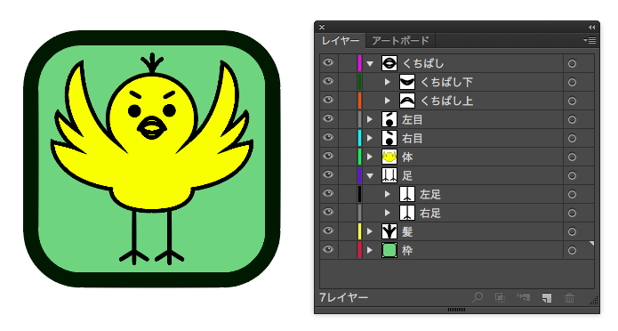
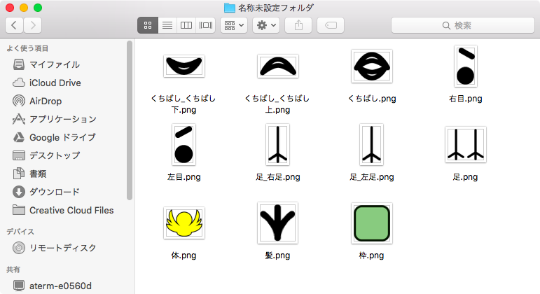

# illustrator-save-for-each-layer
Adobe Illustrator用スクリプト。開いているドキュメントをレイヤーごとに保存する。

# 動作

* レイヤ別にPNG画像として出力します。
* レイヤごとに出力される画像サイズは異なります。
* 出力ファイル名は ”レイヤ名.png” です。
* 親子関係のあるレイヤは、それぞれ出力されます。
    * 子レイヤのファイル名は "親レイヤ名_子レイヤ名.png" です。

# 使い方

1. レイヤを分けたドキュメントを開いておく
    

2. スクリプトを実行

3. 保存先フォルダを選択する

4. 完了
    

# 課題

* 動作後、レイヤの表示状態を復元したい。[#1](https://github.com/naichilab/illustrator-save-for-each-layer/issues/1)  
現状はすべて表示状態になる。

* 保存対象レイヤを選択したい。[#2](https://github.com/naichilab/illustrator-save-for-each-layer/issues/1)
